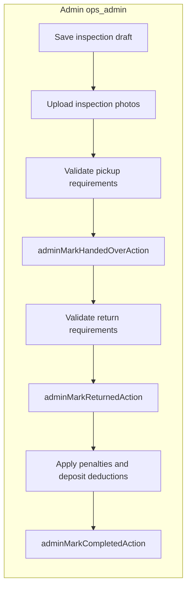

# Vehicle handover and return management

## Design choices (aligned with current Oxour Go)

- **Lifecycle semantics:** Keep DB [`booking_status`](c:\Users\DELL\Desktop\oxourgo\frontend\lib\admin\actions\booking-actions.ts) as `pending_payment` | `confirmed` | `active` | `completed` | `cancelled`. Treat **“handed over”** as `booking_status === 'active'` with [`handed_over_at`](c:\Users\DELL\Desktop\oxourgo\frontend\lib\supabase\database.types.ts) set (existing [`adminMarkHandedOverAction`](c:\Users\DELL\Desktop\oxourgo\frontend\lib\admin\actions\booking-actions.ts)). Treat **“returned”** as `returned_at IS NOT NULL` while still `active` (existing [`adminMarkReturnedAction`](c:\Users\DELL\Desktop\oxourgo\frontend\lib\admin\actions\booking-actions.ts)). **“Completed”** remains [`adminMarkCompletedAction`](c:\Users\DELL\Desktop\oxourgo\frontend\lib\admin\actions\booking-actions.ts). This avoids breaking overlap RPCs, payment helpers in [`lib/payments/booking-payment.ts`](c:\Users\DELL\Desktop\oxourgo\frontend\lib\payments\booking-payment.ts), notifications, and customer badges in [`lib/customer/booking-display.ts`](c:\Users\DELL\Desktop\oxourgo\frontend\lib\customer\booking-display.ts).

- **Inspection vs status:** Persist inspection drafts (checklists, readings, notes, photo metadata) **before** calling the existing mark actions, so payment and approval flows stay unchanged.

- **Photos:** Add a **private** Supabase Storage bucket (e.g. `booking_inspection`) with path pattern `bookings/{bookingId}/{pickup|return}/{slot}-{timestamp}.webp` (or original ext), mirroring the proven private-upload + metadata registration pattern from [`features/dashboard/kyc-upload-tile.tsx`](c:\Users\DELL\Desktop\oxourgo\frontend\features\dashboard\kyc-upload-tile.tsx) / [`lib/kyc/upload-kyc-browser.ts`](c:\Users\DELL\Desktop\oxourgo\frontend\lib\kyc\upload-kyc-browser.ts) but **admin-only** registration via new server actions after [`requireAppRole('ops_admin')`](c:\Users\DELL\Desktop\oxourgo\frontend\lib\auth\server.ts) (same security model as other admin mutations: app role + [`createAdminClient()`](c:\Users\DELL\Desktop\oxourgo\frontend\lib\supabase\admin.ts)).

- **Signature:** Capture as **PNG from a small canvas** (lightweight dependency such as `signature_pad` or minimal canvas handler), upload to the same bucket under `.../signature.png`, store path + `signed_at` on the booking or a single handover record—no customer-facing mutation except optional read of their own signed asset via signed URL from server components.

## Database

**Single migration file** (new under [`supabase/migrations/`](c:\Users\DELL\Desktop\oxourgo\frontend\supabase\migrations)) that:

1. **Adds scalar / JSON columns on `public.bookings`** (names illustrative; adjust to match naming in repo):
   - Pickup/return fuel: e.g. `pickup_fuel_level` / `return_fuel_level` (`text` enum via check constraint, or `smallint` 0–100 for percent—pick one and use consistently in UI).
   - Odometer: `pickup_odometer_km`, `return_odometer_km` (`integer` or `bigint`, nullable until captured).
   - Structured condition notes: `pickup_condition_notes` / `return_condition_notes` as `jsonb` with stable keys `{ scratches, dents, fuelNote, cleanliness }` (matches your UX bullets; easy to diff in UI).
   - Penalties (rupees, non-negative integers): `penalty_damage_rupees`, `penalty_late_rupees`, `penalty_extra_km_rupees` (default 0).
   - Deposit deduction: `deposit_penalty_total_rupees` (sum applied from deposit toward penalties) or store only line items in JSON + generated total in app—prefer **explicit total column** for reporting + `deposit_refund_due_rupees` if useful alongside existing [`deposit_held_rupees`](c:\Users\DELL\Desktop\oxourgo\frontend\lib\supabase\database.types.ts) / `deposit_refunded_*`.
   - Signature: `customer_handover_signature_path` (text), `customer_handover_signed_at` (timestamptz).
   - Optional **boolean gates** for UX: `pickup_inspection_completed_at`, `return_inspection_completed_at` (set when admin taps “Save inspection” or when completing wizard—supports timeline without inferring from nullable fields alone).

2. **Adds `public.booking_inspection_photos`** (normalized gallery + timeline):
   - `id`, `booking_id` FK, `phase` (`pickup` | `return`), `slot` (`front` | `rear` | `left` | `right` | `interior` | `other`), `storage_path`, `created_at`, `created_by` (admin user id).
   - Unique partial index if you want **one current photo per slot/phase** (delete old on replace) or allow history—**recommend replace-per-slot** for simpler “gallery” plus optional `replaced_at` if you keep history later.

3. **Adds `public.booking_inspection_events`** (audit-style timeline for admin “vehicle inspection timeline” / “trip condition history”):
   - `id`, `booking_id`, `event_type` (e.g. `pickup_draft_saved`, `pickup_submitted`, `photo_added`, `return_submitted`, `penalty_updated`), `payload` `jsonb`, `actor_user_id`, `created_at`.
   - Append-only from app (no customer writes).

4. **RLS policies** for new tables: `SELECT` for `auth.uid()` when `exists (select 1 from bookings b where b.id = booking_id and b.user_id = auth.uid())`; full read/write for `is_ops_staff()` (same helper as in [`20260523140000_security_rls_hardening.sql`](c:\Users\DELL\Desktop\oxourgo\frontend\supabase\migrations\20260523140000_security_rls_hardening.sql)). **No** customer `INSERT`/`UPDATE` on inspection tables. Service-role admin path remains after `requireAppRole`.

5. **Storage policies** for `booking_inspection` bucket: staff read/write; customer read limited to objects under their booking id prefix (policy using `storage.foldername(name)[1]` = booking id joined to `bookings.user_id`). Align with existing bucket policy style from KYC/fleet migrations.

6. Regenerate or hand-update [`lib/supabase/database.types.ts`](c:\Users\DELL\Desktop\oxourgo\frontend\lib\supabase\database.types.ts) to match.

## Server actions and gates (do not break payments)

- **New module** e.g. [`lib/admin/actions/booking-inspection-actions.ts`](c:\Users\DELL\Desktop\oxourgo\frontend\lib\admin\actions\booking-inspection-actions.ts) (or colocate in `booking-actions.ts` if you prefer fewer files) using [`runInstrumentedServerAction`](c:\Users\DELL\Desktop\oxourgo\frontend\lib\monitoring\instrument-server-action.ts), [`adminActionDbFailed`](c:\Users\DELL\Desktop\oxourgo\frontend\lib\errors\safe-user-message.ts), and `AdminActionResult`.

- **Draft saves:** `adminSavePickupInspectionAction` / `adminSaveReturnInspectionAction` — update new columns + merge [`pickup_checklist`](c:\Users\DELL\Desktop\oxourgo\frontend\components\admin\admin-booking-ops-panel.tsx) / `return_checklist` keys you add (KYC verified, licence checked, payment received, etc.). Keep existing [`adminSaveBookingChecklistsAction`](c:\Users\DELL\Desktop\oxourgo\frontend\lib\admin\actions\booking-actions.ts) behavior or delegate to the new saver to avoid duplicate code paths.

- **Photo upload:** Admin `FormData` → buffer → `createAdminClient().storage.from('booking_inspection').upload` (reuse size/MIME validation from [`lib/admin/actions/fleet-actions.ts`](c:\Users\DELL\Desktop\oxourgo\frontend\lib\admin\actions\fleet-actions.ts)); insert/replace row in `booking_inspection_photos`; on DB failure, `storage.remove` best-effort (KYC-style rollback). Return `{ ok, message }` only—no Postgrest strings to client.

- **Tighten transitions (optional strictness flag):** Extend [`adminMarkHandedOverAction`](c:\Users\DELL\Desktop\oxourgo\frontend\lib\admin\actions\booking-actions.ts) to verify before update:
  - Booking `confirmed`, payment rules (e.g. `pay_at_pickup` → `payment_status` in `received|partial` as appropriate; do **not** change how [`adminMarkBookingPaymentReceivedAction`](c:\Users\DELL\Desktop\oxourgo\frontend\lib\admin\actions\payment-actions.ts) works).
  - KYC / licence: read customer profile via existing [`adminGetBookingCustomerProfile`](c:\Users\DELL\Desktop\oxourgo\frontend\lib\admin\data\bookings.ts) or a small helper—fail with a clear safe message if not verified.
  - Checklist booleans + required photos + signature path present + fuel + odometer filled.
  - Same pattern for [`adminMarkReturnedAction`](c:\Users\DELL\Desktop\oxourgo\frontend\lib\admin\actions\booking-actions.ts): require return checklist, return photos, return readings.

- **Penalties / deposit:** `adminApplyBookingPenaltiesAction` updates penalty columns + deposit deduction total; writes `booking_inspection_events`; does **not** auto-mutate rental `amount_paid` / `payment_status` unless you explicitly integrate with existing payment events—**default: penalties are inspection/deposit accounting only** until you wire a separate “post charge” flow, to avoid breaking [`bookingPaymentBreakdown`](c:\Users\DELL\Desktop\oxourgo\frontend\lib\payments\booking-payment.ts).

- **Customer read:** Add **read-only** server helper or extend [`lib/customer/bookings-queries.ts`](c:\Users\DELL\Desktop\oxourgo\frontend\lib\customer\bookings-queries.ts) to join photo rows and expose **signed URLs** in the dashboard loader (short TTL), not raw storage paths in the client bundle if possible.

## Admin UI

- Evolve [`components/admin/admin-booking-ops-panel.tsx`](c:\Users\DELL\Desktop\oxourgo\frontend\components\admin\admin-booking-ops-panel.tsx) into a **mobile-first tabbed workflow**: Overview | Pickup inspection | Return inspection | Penalties & deposit | Timeline.
  - **Pickup:** checklist (expanded keys beyond current `PICKUP_KEYS`), fuel + odometer inputs, per-slot image uploader with progress + retry, condition notes, signature pad + clear, then enable **Mark handed over** (still calling existing action after validation).
  - **Return:** parallel checklist, photos, side-by-side “pickup vs return” for notes (simple diff of JSON + photo pairs by slot).
  - **Penalties:** three amount fields + running total + deposit applied; “outstanding” badge when penalties &gt; 0 and trip not completed or refund not recorded (define rule in copy).
  - **Timeline:** merge `booking_inspection_events` with existing timestamps (`approved_at`, `handed_over_at`, `returned_at`, `completed_at`, payment events if needed).

- **Admin list filters (optional phase 2):** filter bookings with `penalty_damage_rupees + penalty_late_rupees + penalty_extra_km_rupees &gt; 0` and `booking_status != 'completed'` in [`lib/admin/data/bookings.ts`](c:\Users\DELL\Desktop\oxourgo\frontend\lib\admin\data\bookings.ts) + [`admin-bookings-manager.tsx`](c:\Users\DELL\Desktop\oxourgo\frontend\components\admin\bookings\admin-bookings-manager.tsx).

## Customer dashboard

- Extend [`features/dashboard/customer-booking-detail.tsx`](c:\Users\DELL\Desktop\oxourgo\frontend\features\dashboard\customer-booking-detail.tsx) (already has [`timelineSteps`](c:\Users\DELL\Desktop\oxourgo\frontend\features\dashboard\customer-booking-detail.tsx)):
  - Add substeps for **handover recorded** (data present / `handed_over_at`) and **return inspection** (`returned_at`).
  - Sections: **Handover summary** (non-sensitive subset: fuel label, odometer at pickup—avoid internal scratch notes if policy requires; or show customer-facing summary fields only).
  - **Deposit deductions:** show `deposit_penalty_total_rupees` vs security deposit from vehicle with plain-language breakdown of penalties if non-zero.
  - **Return summary:** return fuel/odometer + “charges applied” line.

- Ensure selects in [`lib/customer/bookings-queries.ts`](c:\Users\DELL\Desktop\oxourgo\frontend\lib\customer\bookings-queries.ts) include only customer-safe columns (no internal ops fields).

## Error handling and optimistic UI

- All mutations return `AdminActionResult`; surface `message` in panel state (already in [`AdminBookingOpsPanel`](c:\Users\DELL\Desktop\oxourgo\frontend\components\admin\admin-booking-ops-panel.tsx)).
- Upload UI: per-file error, keep successful uploads; disable submit while in flight; **`router.refresh()`** after success (existing pattern)—avoid fragile optimistic row injection unless keyed by temp id.
- Log unknown errors with existing helpers; never return raw Postgrest text.

## Testing / verification

- Manual: create booking → approve → fill pickup inspection → handover → return inspection → returned → penalties → completed; confirm customer page shows timeline and amounts.
- Regression: existing approve/reject/cancel/payment received flows untouched; overlap still uses `pending_payment|confirmed|active` only.
