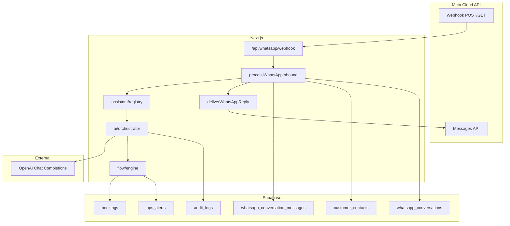

# Oxour Go — WhatsApp AI Integration

Production-grade concierge using **Meta WhatsApp Cloud API**, **OpenAI GPT**, **Next.js API routes**, and **Supabase**.

## Architecture



## Module layout

| Path | Responsibility |
|------|----------------|
| `app/api/whatsapp/webhook/route.ts` | Meta verification (GET), inbound messages (POST), signature + rate limit |
| `lib/whatsapp/process-inbound.ts` | Idempotent persist → assistant → outbound → audit |
| `lib/whatsapp/send.ts` | Meta Graph API text send + retry |
| `lib/whatsapp/outbound.ts` | Send + log outbound row |
| `lib/whatsapp/ai/orchestrator.ts` | GPT JSON turn + flow engine + escalation |
| `lib/whatsapp/flow/engine.ts` | Deterministic booking pipeline |
| `lib/whatsapp/duplicate-guard.ts` | Same thread + vehicle + window dedupe |
| `lib/whatsapp/escalation.ts` | Pause AI, ops handoff |
| `lib/whatsapp/admin-notify.ts` | `ops_alerts` for escalation & bookings |
| `lib/ai/openai.ts` | OpenAI client (fetch, JSON mode) |

## Database schema

Existing (`20260620120000_whatsapp_operations.sql`):

- `customer_contacts` — E.164 identity, optional `user_id`
- `whatsapp_conversations` — `flow_state`, `context` jsonb, `active_booking_id`
- `whatsapp_conversation_messages` — append-only log, `idempotency_key`
- `bookings.booking_source`, `customer_contact_id`, `whatsapp_conversation_id`

New (`20260629120000_whatsapp_ai_integration.sql`):

- `whatsapp_conversations.escalated_at`, `escalation_reason`, `ai_enabled`, `last_ai_turn_at`, `last_ai_model`
- Unique index `bookings_whatsapp_active_dedupe_idx` — prevents duplicate active bookings per thread/vehicle/dates

## Flow states

`inquiry` → `collecting_dates` → `suggesting_vehicle` → `creating_booking` → `awaiting_kyc` → `payment_workflow` → `awaiting_admin_confirmation` → `confirmed` / `closed`

Escalation sets `status = paused`, `escalated_at`, `ai_enabled = false`.

## Environment variables

```env
WHATSAPP_WEBHOOK_VERIFY_TOKEN=
WHATSAPP_APP_SECRET=
WHATSAPP_ACCESS_TOKEN=
WHATSAPP_PHONE_NUMBER_ID=
WHATSAPP_API_VERSION=v21.0

OPENAI_API_KEY=
OPENAI_MODEL=gpt-4o-mini
WHATSAPP_AI_ENABLED=1
```

Without `OPENAI_API_KEY`, the system falls back to **rule-based** flow replies (still logs + sends if Meta tokens are set).

## Deployment

1. Apply migrations: `20260620120000_whatsapp_operations.sql` (if needed), `20260629120000_whatsapp_ai_integration.sql`
2. Set env vars on Vercel (server-only secrets)
3. Meta Developer Console → WhatsApp → Configuration:
   - Callback URL: `https://www.oxourgo.com/api/whatsapp/webhook`
   - Verify token: matches `WHATSAPP_WEBHOOK_VERIFY_TOKEN`
   - Subscribe to `messages`
4. Deploy frontend; test GET challenge from Meta
5. Link WhatsApp contacts to `auth.users` in admin before automated booking (`contact.user_id` required)

## Testing strategy

| Layer | Approach |
|-------|----------|
| Unit | `tests/unit/whatsapp-ai.test.ts` — slot extraction, duplicate guard keys |
| Webhook | `curl` GET verify; POST with signed body (Meta test button) |
| Integration | Staging number → full flow: dates → vehicle # → CONFIRM |
| AI off | Unset `OPENAI_API_KEY` → rule fallback still completes flow |
| Escalation | Message "speak to human" → `escalated_at` set, ops alert fired |
| Dedupe | Repeat CONFIRM → existing booking id returned, no second insert |

## Admin dashboard

- `/admin/whatsapp` — conversation list (flow state, contact, booking link)
- `/admin/bookings?source=whatsapp` — channel filter
- Ops alerts — `whatsapp_escalation`, `whatsapp_booking_created`
- Audit — `whatsapp.message_inbound`, `whatsapp.message_outbound`, `whatsapp.escalated`, `whatsapp.booking_created`

## Observability

- `[admin:query]` / `logPostgrestError` on DB failures
- Sentry via `captureRouteException` on webhook + process-inbound
- PostHog `adminAction` on audit writes with actor
- Message `payload` stores `assistant`, `nextFlowState`, delivery errors

## KYC & payments

- KYC: link to `{SITE_URL}/dashboard/kyc` when profile not approved
- Payment: reads `bookings.payment_status`, `amount_due`, `amount_paid`; pay_at_pickup default
- Admin confirms in `/admin/bookings/[id]` — existing ops workflow
